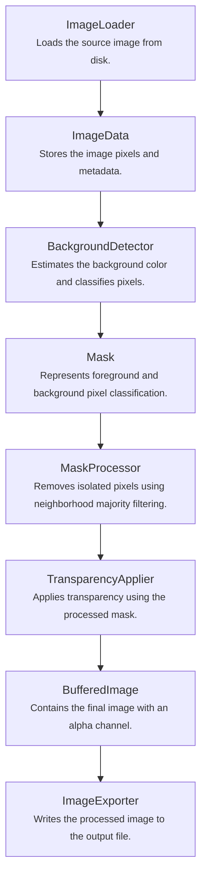

# Java Background Remover

A personal Java project to learn image processing by building a background removal pipeline from scratch.

## Project Overview

I created this project to deepen my Java knowledge while exploring the fundamentals of image processing.

The goal was to build a complete background removal application without relying on artificial intelligence or external image processing libraries. Instead, every step of the pipeline is implemented from scratch to better understand how digital images are represented and manipulated in Java.

This project focuses on learning concepts such as image representation, pixel manipulation, object-oriented design, and clean software architecture.

## Features

- Load an image
- Estimate the background color from image borders
- Classify pixels using RGB color distance
- Generate a binary mask
- Post-process the binary mask using neighborhood majority filtering
- Apply transparency
- Export the result as a PNG image

## Architecture



## Technologies

- Java 25
- Maven
- JUnit 5

## Installation

```bash
git clone https://github.com/KelianHalleray/bg-eraser.git
cd bg-eraser
mvn package
```

## Example

### Original image


### Generated mask


### Final result


## Project Structure

```text
src
├── detection      # Background detection algorithms
├── image          # Image models, loading and exporting
├── mask           # Mask representation and visualization
├── processing     # Image post-processing
└── exception      # Custom exceptions
```

## What I Learned

Throughout this project, I learned about:

- Image representation in Java
- Pixel manipulation
- ARGB color model and bitwise operations
- BufferedImage API
- Object-oriented design
- Separation of responsibilities (SRP)
- Custom exception handling
- Building a modular application with Maven
- RGB color distance
- Background color estimation from image borders
- Unit testing with JUnit 5
- Continuous integration with GitHub Actions

## Current Limitations

The current implementation works best with images that have a relatively uniform background.

Pixels near subject edges may still contain traces of the original background color, especially around hair and other fine details. 
This can produce a visible color halo because the current mask is binary and does not yet support partial transparency or color spill correction.

## Roadmap
### Planned Improvements

- [x] Improve the background detection algorithm using border color estimation
- [ ] Make the background tolerance configurable
- [x] Remove isolated mask pixels using neighborhood majority filtering
- [ ] Add erosion and dilation
- [ ] Add mask edge smoothing
- [ ] Support partial transparency around subject edges
- [ ] Add green spill suppression
- [ ] Increase edge quality around the subject
- [x] Write comprehensive unit tests
- [x] Add continuous integration with GitHub Actions
- [ ] Add a command-line interface
- [ ] Support additional image formats (WebP, TIFF, ...)
- [ ] Improve project documentation